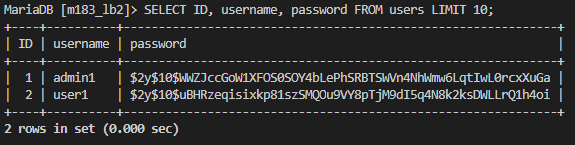

# Sicherheitslücken in der M183-LB2 Anwendung
---
## 1. SQL Injection
### Sicherheitslücke 1:
**Ort**: login.php (Zeile 37)
**Problem**: Die SQL-Query verwendet direkt den eingegebenen Usernamen ohne Prepared Statements
  ```php
  $stmt = $conn->prepare("SELECT id, username, password FROM users WHERE username='$username'");
  ```
**Fix**: Prepared Statement mit korrektem Parameter-Binding verwenden
  ```php
  $stmt = $conn->prepare("SELECT id, username, password FROM users WHERE username=?");
  $stmt->bind_param("s", $username);
  ```

### Sicherheitslücke 2:
**Ort**: edit.php (Zeile 25)
**Problem**: Ungefilterter Parameter wird in SQL-Query genutzt
  ```php
  $stmt = executeStatement("select ID, title, state from tasks where ID = $taskid");
  ```
**Fix**: Prepared Statement mit Parameter-Binding verwenden
  ```php
  $stmt = $conn->prepare("select ID, title, state from tasks where ID = ?");
  $stmt->bind_param("i", $taskid);
  ```

### Sicherheitslücke 3:
**Ort**: savetask.php (Zeile 34)
**Problem**: Ungefilterter Parameter wird in SQL-Query genutzt
  ```php
  $stmt = executeStatement("select ID, title, state from tasks where ID = $taskid");
  ```
**Fix**: Prepared Statement mit Parameter-Binding verwenden
  ```php
  $stmt = $conn->prepare("select ID, title, state, userID from tasks where ID = ?");
  $stmt->bind_param("i", $taskid);
  ```

### Sicherheitslücke 4:
**Ort**: savetask.php (Zeile 61 & 68)
**Problem**: Variablen werden direkt in SQL-Abfragen eingesetzt
  ```php
  $stmt = executeStatement("insert into tasks (title, state, userID) values ('$title', '$state', '$userid')");
  $stmt = executeStatement("update tasks set title = '$title', state = '$state' where ID = $taskid");
  ```
**Fix**: Prepared Statements mit Parameter-Binding verwenden
  ```php
  $stmt = $conn->prepare("INSERT INTO tasks (title, state, userID) VALUES (?, ?, ?)");
  $stmt->bind_param("ssi", $title, $state, $userid);
  $stmt = $conn->prepare("UPDATE tasks SET title = ?, state = ? WHERE ID = ?");
  $stmt->bind_param("ssi", $title, $state, $taskid);
  ```

### Sicherheitslücke 5:
**Ort**: search/v2/index.php (Zeile 13)
**Problem**: Ungefilterter Suchparameter wird in SQL verwendet
  ```php
  $stmt = executeStatement("select ID, title, state from tasks where userID = $userid and title like '%$terms%'");
  ```
**Fix**: Prepared Statement mit Parameter-Binding verwenden
  ```php
  $searchTerm = "%$terms%";
  $stmt = $conn->prepare("select ID, title, state from tasks where userID = ? and title like ?");
  $stmt->bind_param("is", $userid, $searchTerm);
  ```

### Sicherheitslücke 6:
**Ort**: user/tasklist.php (Zeile 16)
**Problem**: Ungefilterter Parameter wird in SQL verwendet
  ```php
  $stmt = $conn->prepare("select ID, title, state from tasks where UserID = $userid");
  ```
**Fix**: Prepared Statement mit Parameter-Binding verwenden
  ```php
  $stmt = $conn->prepare("SELECT ID, title, state FROM tasks WHERE UserID = ?");
  $stmt->bind_param("i", $userid);
  ```

### Sicherheitslücke 7:
**Ort**: fw/header.php (Zeile 20)
**Problem**: Ungefilterter Parameter wird in SQL verwendet
  ```php
  $stmt = executeStatement("select users.id userid, roles.id roleid, roles.title rolename from users inner join permissions on users.id = permissions.userid inner join roles on permissions.roleID = roles.id where userid = $id");
  ```
**Fix**: Prepared Statement mit Parameter-Binding verwenden
  ```php
  $stmt = $conn->prepare("SELECT users.id, roles.id, roles.title FROM users 
                            INNER JOIN permissions ON users.id = permissions.userid 
                            INNER JOIN roles ON permissions.roleID = roles.id 
                            WHERE users.id = ?");
  $stmt->bind_param("i", $id);
  ```

## 2. Unsichere Passwortverarbeitung
### Sicherheitslücke 8:
**Ort**: db/m183_lb2.sql (Zeile 133)
**Problem**: Passwörter werden im Klartext gespeichert in der Datenbank
  ```sql
  insert into users (ID, username, password) values (1, 'admin1', 'Awesome.Pass34');
  insert into users (ID, username, password) values (2, 'user1', 'Amazing.Pass23');
  ```
**Fix**: Ich habe die Passwörter mit dem neu erstellten file update_passwords.php gehashed:
**update_passwords.php**
```php
<?php
// File for hashing all user passwords

// Include database configuration
require_once 'config.php';

// Create database connection
$conn = new mysqli(DB_HOST, DB_USER, DB_PASS, DB_NAME);

// Check connection
if ($conn->connect_error) {
    error_log("Connection failed: " . $conn->connect_error);
    die("Database connection error. Please contact the administrator.");
}

// Get all users
$result = $conn->query("SELECT ID, username, password FROM users");

// Iterate through users and update passwords with hash
while ($row = $result->fetch_assoc()) {
    // Hash the existing password
    $hashed_password = password_hash($row['password'], PASSWORD_DEFAULT);
    
    // Prepare update statement
    $stmt = $conn->prepare("UPDATE users SET password = ? WHERE ID = ?");
    $stmt->bind_param("si", $hashed_password, $row['ID']);
    
    // Execute the update
    if ($stmt->execute()) {
        echo "Updated password for user: " . $row['username'] . "<br>";
    } else {
        echo "Error updating password for user: " . $row['username'] . "<br>";
    }
    
    $stmt->close();
}

// Close connection
$result->close();
$conn->close();

echo "Password update complete.";
?>
```
Hier noch die Überprüfung auf der DB:


### Sicherheitslücke 9:
**Ort**: login.php (Zeile 51)
**Problem**: Passwörter werden im Klartext verglichen
  ```php
  if ($password == $db_password)
  ```
**Fix**: Checken ob das Passwort als Klartext mit dem Gehashten Passwort übereinstimmt
  ```php
  if (password_verify($password, $db_password))
  ```

## 3. Unsichere Cookie-Verwaltung
### Sicherheitslücke 10:
**Ort**: login.php (Zeile 53)
**Problem**: Cookies ohne https und secure Flags
  ```php
  setcookie("username", $username, -1, "/");
  setcookie("userid", $db_id, -1, "/");
  ```
**Fix**: Sichere Cookie-Optionen aktivieren
  ```php
  setcookie("username", $username, -1, "/", "", isset($_SERVER["HTTPS"]), true);
  setcookie("userid", $db_id, -1, "/", "", isset($_SERVER["HTTPS"]), true);
  ```

## 4. Cross-Site Scripting (XSS)
### Sicherheitslücke 11:
**Ort**: admin/users.php (Zeile 46)
**Problem**: Ungefilterter Output von Datenbankdaten
  ```php
  echo "<tr><td>$db_id</td><td>$db_username</td><td>$db_title</td><input type='hidden' name='password' value='$db_password' /></tr>";
  ```
**Fix**: Alle Ausgaben mit htmlspecialchars() filtern
  ```php
  echo "<tr><td>" . htmlspecialchars($db_id) . "</td><td>" . htmlspecialchars($db_username) . "</td><td>" . htmlspecialchars($db_title) . "</td></tr>";
  ```

## 5. Server-Side Request Forgery (SSRF)
### Sicherheitslücke 12:
**Ort**: search.php (Zeile 11)
**Problem**: Der URL-Parameter kann manipuliert werden
  ```php
  $theurl='http://localhost'.$provider.'?userid='.$userid.'&terms='.$terms;
  ```
**Fix**: Whitelist für erlaubte URLs implementieren
  ```php
  // SSRF Protection: Whitelist allowed providers
   $allowed_providers = [
      "/search/v2/",  // Only allow specific, safe search endpoints
   ];

   // Strict validation of provider
   if (!in_array($provider, $allowed_providers)) {
      die("Invalid search provider: Access Denied");
   }
  ```

## 6. Unsichere direkte Objekt-Referenzen
### Sicherheitslücke 13:
**Ort**: edit.php (Zeile 25, 31 & 40)
**Problem**: Keine Überprüfung, ob der angemeldete Benutzer berechtigt ist, die angeforderte Task zu bearbeiten
  ```php
  $stmt = $conn->prepare("select ID, title, state from tasks where ID = ?");
  $stmt->bind_param("i", $taskid);
  ```
**Fix**: Implementierung einer Zugriffskontrolle
  ```php
  $userid = $_COOKIE['userid'];

  $stmt = $conn->prepare("select ID, title, state from tasks where ID = ? AND userID = ?");
  $stmt->bind_param("ii", $taskid, $userid);

  /* Existing code:
  if ($stmt->num_rows > 0) {
    ...
  } */ else {
    header('HTTP/1.1 403 Forbidden');
    die("You do not have permission to modify this task.");
  }
  ```

### Sicherheitslücke 14:
**Ort**: savetask.php (Zeile 22, 35 & 69)
**Problem**: Keine Überprüfung, ob der angemeldete Benutzer berechtigt ist, die angeforderte Task zu bearbeiten
  ```php
  $stmt = $conn->prepare("select ID, title, state, userID from tasks where ID = ?");
  $stmt->bind_param("i", $taskid);

  $stmt = $conn->prepare("UPDATE tasks SET title = ?, state = ? WHERE ID = ?");
  $stmt->bind_param("ssi", $title, $state, $taskid);
  ```
**Fix**: Implementierung einer Zugriffskontrolle
  ```php
  $userid = $_COOKIE['userid'];

  $stmt = $conn->prepare("select ID, title, state, userID from tasks where ID = ? AND userID = ?");
  $stmt->bind_param("ii", $taskid, $userid);

  $stmt = $conn->prepare("UPDATE tasks SET title = ?, state = ? WHERE ID = ?  AND userID = ?");
  $stmt->bind_param("ssii", $title, $state, $taskid, $userid);
  ```

## 7. Session Fixation
### Sicherheitslücke 15:
**Ort**: login.php (Zeile 56)
**Problem**: Keine Session-Rotation beim Login

**Fix**: Nach erfolgreicher Authentifizierung session_regenerate_id() aufrufen
  ```php
  // Secure the session by regenerating the session ID
  session_regenerate_id(true);
  ```

### Sicherheitslücke 16:
**Ort**: logout.php
**Problem**: Keine Session-Rotation und Deletion beim Logout
  ```php
  <?php
    
    unset($_COOKIE['username']); 
    setcookie('username', '', -1, '/'); 
    unset($_COOKIE['userid']); 
    setcookie('userid', '', -1, '/'); 

    header("Location: /");
    exit();
  ?>
  ```
**Fix**: Nochmals session_regenerate_id() aufrufen und dannach alle Session & Cookie Daten löschen
  ```php
  <?php
    // Ensure session is started
    if (session_status() == PHP_SESSION_NONE) {
        session_start();
    }

    // Regenerate session ID to prevent session fixation attacks
    session_regenerate_id(true);

    unset($_COOKIE['username']); 
    setcookie('username', '', -1, '/'); 
    unset($_COOKIE['userid']); 
    setcookie('userid', '', -1, '/'); 

    // Destroy the session
    session_unset();
    session_destroy();
    
    header("Location: /");
    exit();
  ?>
  ```

## 8. Passwort zu sehen
### Sicherheitslücke 17:
**Ort**: admin/users.php (Zeile 46)
**Problem**: Passwörter werden im HTML-Quellcode gespeichert
  ```php
  <input type='hidden' name='password' value='$db_password' />
  ```
**Fix 1**: Passwörter niemals in HTML-Code einfügen, komplett entfernen

**Fix 2**: Ich habe die Passwörter gehashed siehe **Sicherheitslücke 9**, darum hätte man sowieso nur das gehashte Passwort gesehen.

## 9. Fehlende Content Security Policy
### Sicherheitslücke 18:
**Ort**: fw/header.php (Zeile 3)
**Problem**: Keine Content Security Policy (CSP) Header

**Fix**: CSP-Header implementieren, um XSS-Angriffe zu reduzieren
  ```php
  header("Content-Security-Policy: default-src 'self'; script-src 'self' https://cdnjs.cloudflare.com;");
  ```
**Bemerkung**
Ich wollte es verwenden aber dann hat es einige Abfragen geblocket (z.B. Task-search etc.), darum habe ich es wieder entfernt.

## 10. Unsichere Password-Felder
### Sicherheitslücke 19:
**Ort**: login.php (Zeile 64)
**Problem**: Passwort-Feld als Textfeld anstatt Passwort-Feld
  ```php
  <input type="text" class="form-control size-medium" name="password" id="password">
  ```
**Fix**: Typ auf "password" ändern
  ```php
  <input type="password" class="form-control size-medium" name="password" id="password">
  ```

## 11. Klartext Datenbank-Anmeldedaten
### Sicherheitslücke 20:
**Ort**: config.php
**Problem**: Datenbank-Anmeldedaten im Klartext im Code
  ```php
  define('DB_HOST', 'm183-lb2-db');
  define('DB_USER', 'root');
  define('DB_PASS', 'Some.Real.Secr3t');
  ```
**Fix**: Implementierung einer umgebungsbasierten Konfiguration für Datenbank-Anmeldedaten
  ```php
  <?php
  // Safely define database constants using environment variables or fallback values
  define('DB_HOST', getenv('DB_HOST') !== false ? getenv('DB_HOST') : 'm183-lb2-db');
  define('DB_USER', getenv('DB_USER') !== false ? getenv('DB_USER') : 'root');
  define('DB_PASS', getenv('DB_PASS') !== false ? getenv('DB_PASS') : 'Some.Real.Secr3t');
  define('DB_NAME', getenv('DB_NAME') !== false ? getenv('DB_NAME') : 'm183_lb2');

  // Optional: Additional security check
  if (defined('DB_PASS') && DB_PASS === 'Some.Real.Secr3t') {
      error_log("Warning: Using default database password!\n", 3, __DIR__ . "/logs/error.log");
  }
  ?>
  ```

## 12. Fehlende Input-Validation & Input-Sanitization
Added file: **validateInput.php**
  ```php
  <?php
  function sanitizeAndvalidateInput($input) {
      // Trim whitespace, remove HTML tags, and encode special characters
      $sanitized = htmlspecialchars(strip_tags(trim($input)), ENT_QUOTES, 'UTF-8');
      
      // Validate string length (for example, title should be between 1 and 50 characters)
      if (strlen($sanitized) < 1 || strlen($sanitized) > 50) {
          die("Input must be between 1 and 50 characters.");
      }
      
      // Validate that the string only contains allowed characters
      // This allows letters, numbers, spaces, and basic punctuation
      if (!preg_match('/^[a-zA-Z0-9\s\-\_\.]+$/', $sanitized)) {
          die("Input contains invalid characters.");
      }

      return $sanitized;
  }

  function validateUsername($username) {
      // Trim whitespace from the beginning and end
      $username = trim($username);

      // Ensure username length is between 3 and 30 characters
      if (strlen($username) < 3 || strlen($username) > 30) {
          die("Username must be between 3 and 30 characters.");
      }

      // Allow only letters, numbers, underscore (_), hyphen (-), and dot (.)
      if (!preg_match('/^[a-zA-Z0-9._-]+$/', $username)) {
          die("Username can only contain letters, numbers, '_', '-', or '.'");
      }

      return $username;
  }

  function validatePassword($password) {
      // Trim whitespace from the beginning and end
      $password = trim($password);

      // Ensure password length is between 8 and 64 characters
      if (strlen($password) < 8 || strlen($password) > 64) {
          die("Password must be between 8 and 64 characters.");
      }

      // Require at least one uppercase letter, one lowercase letter, one number, and one special character
      if (!preg_match('/[A-Z]/', $password) ||  // At least one uppercase letter
          !preg_match('/[a-z]/', $password) ||  // At least one lowercase letter
          !preg_match('/[0-9]/', $password) ||  // At least one number
          !preg_match('/[\W]/', $password)) {   // At least one special character
          die("Password must include at least one uppercase letter, one lowercase letter, one number, and one special character.");
      }

      return $password;
  }
  ?>
  ```

### Sicherheitslücke 21:
**Ort**: edit.php (Zeile 33)
**Problem**: Keine Validierung der Eingabedaten
  ```php
  $title = $db_title;
  ```
**Fix**: Validierung um XSS-Attacken, zu lange Eingaben und leere Eingaben zu verhindern
  ```php
  require_once 'validateInput.php';
  $title = sanitizeAndvalidateInput($db_title);
  ```

### Sicherheitslücke 22:
**Ort**: savetask.php (Zeile 56)
**Problem**: Keine Validierung der Eingabedaten
  ```php
  $title = $_POST['title'];
  ```

**Fix**: Validierung um XSS-Attacken, zu lange Eingaben und leere Eingaben zu verhindern
  ```php
  require_once 'validateInput.php';
  $title = sanitizeAndvalidateInput($_POST['title']);
  ```

### Sicherheitslücke 23:
**Ort**: search/v2/index.php (Zeile 8)
**Problem**: Keine Validierung der Eingabedaten
  ```php
  $terms = $_GET["terms"];
  ```

**Fix**: Validierung um XSS-Attacken, zu lange Eingaben und leere Eingaben zu verhindern
  ```php
  require_once '../../validateInput.php';
  $terms = sanitizeAndvalidateInput($_GET["terms"]);
  ```

### Sicherheitslücke 24:
**Ort**: search.php (Zeile 8)
**Problem**: Keine Validierung der Eingabedaten
  ```php
  $terms = $_POST["terms"];
  ```

**Fix**: Validierung um XSS-Attacken, zu lange Eingaben und leere Eingaben zu verhindern
  ```php
  require_once 'validateInput.php';
  $terms = sanitizeAndvalidateInput($_POST["terms"]);
  ```

### Sicherheitslücke 25:
**Ort**: login.php (Zeile 28)
**Problem**: Keine Validierung der Eingabedaten
  ```php
  $username = $_GET['username'];
  $password = $_GET['password'];
  ```

**Fix**: Validierung um XSS-Attacken, zu lange Eingaben und leere Eingaben zu verhindern
  ```php
  require_once 'validateInput.php';
  $username = validateUsername($_GET['username']);
  $password = validatePassword($_GET['password']);
  ```


## 13. Lack of Security Logging
### Sicherheitslücke 26:
**Ort**: login.php (Zeile 17, 61, 70 & 76)
**Problem**: Der Anwendung fehlt ein umfassendes logging sicherheitsrelevanter Ereignisse.

**Fix**: Logging des Statuses ob man erfolgreich eingeloggt ist oder nicht in das file **logs/error.log**
```php
$ip = $_SERVER['REMOTE_ADDR'];
$time = date('Y-m-d H:i:s');

error_log("Successful login: User $username from IP $ip at $time\n", 3, __DIR__ . "/logs/error.log");

error_log("Failed login attempt: Username $username from IP $ip at $time\n", 3, __DIR__ . "/logs/error.log");
```

## 14. Cross-Site Request Forgery (CSRF)
**Ort**: Mehrere Formulare
**Problem**: Keine CSRF-Token in Formularen

**Fix**: CSRF-Token für jedes Formular hinzufügen und beim Absenden validieren
  ```php
  // Token generieren
  $_SESSION['csrf_token'] = bin2hex(random_bytes(32));
  
  // Im Formular einfügen
  <input type="hidden" name="csrf_token" value="<?php echo $_SESSION['csrf_token']; ?>">
  
  // Beim Formular-Submit überprüfen
  if (!hash_equals($_SESSION['csrf_token'], $_POST['csrf_token'])) {
      die('CSRF-Angriff erkannt');
  }
  ```


### Security Features
- User authentication check
- Task ownership verification
- Prevention of unauthorized task deletion
- Prepared statements to prevent SQL injection
- User feedback mechanism

1. CSRF-Token anschauen
2. ganze Cookie und session situation anschauen
3. Douk überarbeiten
4. Claude fragen was es noch gibt
5. Alle Änderungen mit Doku überprüfen

---
### added delete.php

